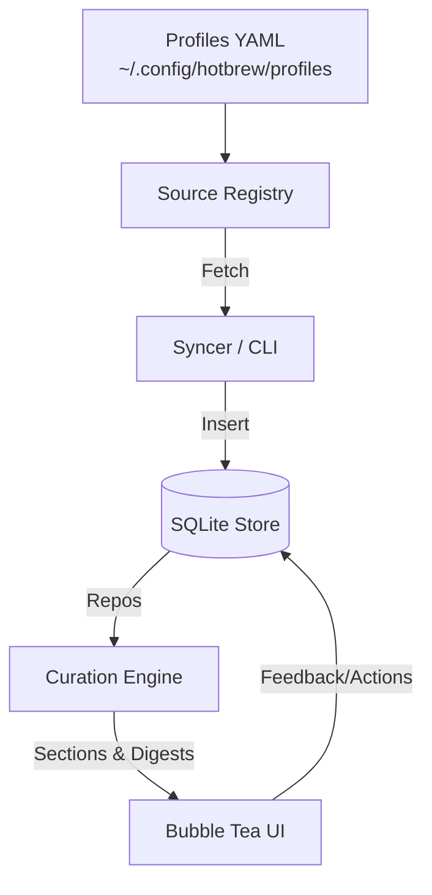

# ☕ hotbrew

**Your morning, piping hot.**

A beautiful terminal newsletter that aggregates your daily information into a single, scannable digest.


[](https://opensource.org/licenses/MIT)

## Features

- **One-command digest** – `hotbrew` automatically syncs fresh sources and launches the TUI.
- **Manifest-driven sources** – Customize feeds via YAML profiles in `~/.config/hotbrew/profiles/` without rebuilding.
- **Keyboard + theme picker** – Smooth Bubble Tea UI with timeline navigation, per-item actions, and a `t` theme selector.
- **Local-first store** – SQLite cache plus repository layer for deduped items, digests, and feedback.
- **Fast** – Single binary, instant startup.

## TL;DR – Quick Start

```bash
# 1. Clone + enter the repo
git clone https://github.com/jcornudella/hotbrew.git
cd hotbrew

# 2. (Optional) write ~/.config/hotbrew/hotbrew.yaml
hotbrew config --init

# 3. Fetch sources + launch the TUI
go run ./cmd/hotbrew      # or: go install ./cmd/hotbrew && hotbrew

# Inside the UI: j/k navigate · enter expand · t themes · p profiles · q quit
```

Hotbrew stores data under `~/.config/hotbrew/` (SQLite DB + manifests). Re-run `hotbrew` whenever you want the latest digest, or add it to cron/shell startup for a daily ritual.

Prefer a one-liner? The installer ensures Go is present (via Homebrew/apt/yum/pacman) and sets up hotbrew:

```bash
curl -fsSL https://hotbrew.dev/install.sh | bash
```

## Installation

```bash
# With Go
go install github.com/jcornudella/hotbrew/cmd/hotbrew@latest

# Build from source
git clone https://github.com/jcornudella/hotbrew.git
cd hotbrew
make build
./hotbrew
```

## Usage

```bash
# Fetch latest sources + open TUI
hotbrew

# Initialize config (writes ~/.config/hotbrew/hotbrew.yaml)
hotbrew config --init

# List & set themes via CLI
hotbrew theme          # list
hotbrew theme nord     # apply

# Show help
hotbrew help
```

## Keyboard Shortcuts

| Key | Action |
|-----|--------|
| `j` / `k` | Navigate up/down |
| `↑` / `↓` | Navigate up/down |
| `tab` | Next section |
| `shift+tab` | Previous section |
| `enter` / `e` | Expand/collapse item |
| `o` | Open in browser |
| `c` | Open comments (HN) |
| `r` | Refresh |
| `t` | Theme picker |
| `1-9` | Jump to section |
| `q` / `esc` | Quit |

## Configuration

Config file: `~/.config/hotbrew/hotbrew.yaml`

```yaml
# Theme & profile
theme: synthwave
profile: default

sources:
  hackernews:
    enabled: true
    settings:
      max: 8
```

### Profiles & manifests

Hotbrew loads sources from `~/.config/hotbrew/profiles/<name>.yaml`. A default manifest is written on first run. Switch manifests by updating the `profile:` field or editing the YAML files directly. Each entry can point at drivers like `hackernews`, `tldr`, `github-trending`, etc., with custom queries, tags, or feed URLs.

## Themes

Press `t` inside the TUI to bring up the picker. Use `←/→` (or `h/l`) to preview, `enter` to apply, and `esc` to cancel. Built-in palettes include Synthwave, Nord, Dracula, Mocha, Ocean, Forest, Sunset, and Midnight. You can register custom palettes via config for a fully bespoke look.

## Architecture



- **Profiles** – YAML manifests declare drivers, queries, feeds, and icons. Selecting a profile in `hotbrew.yaml` determines which sources are registered.
- **Syncer** – `hotbrew sync`, the daemon, or the startup `sync-and-run` command fetch each source, normalize items into TRSS, and persist via repositories.
- **Store/Repo layer** – SQLite holds items, state, rules, digests, and feedback. The `internal/store/repo` package provides typed accessors so future sqlc code or remote stores can drop in.
- **Curation engine** – Deduplicates, scores, enforces diversity, and builds digests consumed by `hotbrew digest` and the TUI.
- **Bubble Tea UI** – Timeline layout with theme picker, per-item actions, and live feedback prompts.

## Branding & Optional Assets

The open-source tree intentionally ignores branded art and helper scripts:

- `assets/` holds working PSD/SVG exports or marketing previews—keep your copies locally.
- `internal/ui/components/logo.png` (and the experimental `logo.go`) stay out of Git so you can drop in any inline logo without publishing it. The ASCII fallback header included in this repo still renders everywhere.
- `tools/` is for personal conversion scripts or image helpers used while iterating on assets.

To customize the inline logo without sharing it:

1. Save a transparent PNG roughly 11×4 cells to `internal/ui/components/logo.png`.
2. Run `go run ./cmd/hotbrew` inside a Kitty/iTerm/WezTerm session to preview the inline image. Text-only terminals will keep using the ASCII banner.
3. Because these paths are in `.gitignore`, your proprietary branding never leaves your machine while the rest of the project remains fully open-source.

## Roadmap

- [ ] Finish repository/sqlc migration for all store operations
- [ ] Harden network sync (retries, TLS pinning) and secure token storage
- [ ] Expand manifest schema (remote profiles, richer options)
- [ ] GitHub/Linear/Calendar integrations
- [ ] AI summarization + plugin system

## Contributing

Contributions welcome! See [CONTRIBUTING.md](CONTRIBUTING.md).

## License

MIT - see [LICENSE](LICENSE)

---

Built with [Bubble Tea](https://github.com/charmbracelet/bubbletea) and [Lip Gloss](https://github.com/charmbracelet/lipgloss).
